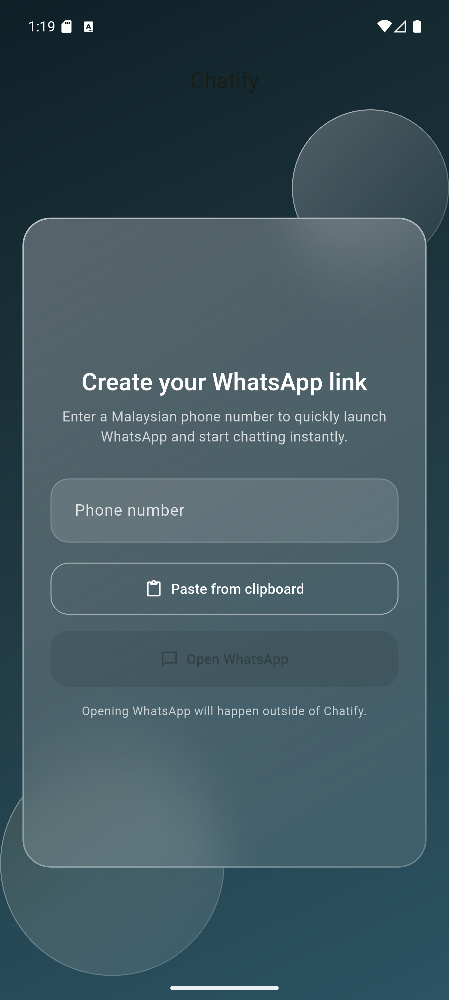
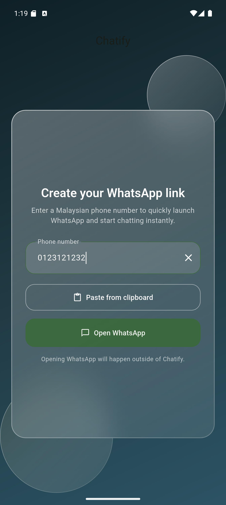
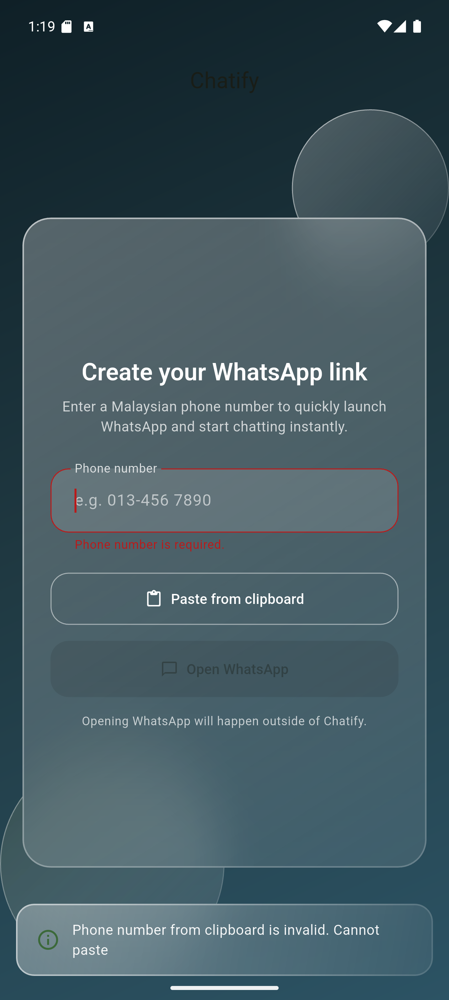

# Chatify

A Flutter application that allows users to open WhatsApp with Malaysian phone numbers in any format.

## Features

- Accept Malaysian phone numbers in various formats:
  - `0134567890`
  - `601345678990`
  - `+6013-4456 7890`
  - `013-296 7890`
  - `013 296 7890`
- Validates and normalizes phone numbers
- Opens WhatsApp with the formatted number (without `+` symbol)
- Clean Architecture with BLoC state management

## Screenshots

<div style="display: flex; justify-content: space-around;">
  
  
  
</div>

## Architecture

This project follows **Clean Architecture** principles with clear separation of concerns:

```
lib/
├── app/
│   └── app.dart                          # Main app widget with BLoC provider
├── features/
│   └── whatsapp_link/
│       ├── domain/                       # Business logic layer
│       │   ├── entities/
│       │   │   └── phone_number.dart     # Phone number entity
│       │   ├── exceptions/
│       │   │   └── invalid_phone_number_exception.dart
│       │   ├── repositories/
│       │   │   └── phone_number_repository.dart  # Repository interface
│       │   ├── services/
│       │   │   └── whatsapp_launcher.dart        # Launcher service interface
│       │   ├── usecases/
│       │   │   └── normalize_malaysian_number.dart
│       │   └── value_objects/
│       │       └── launch_result.dart    # Result type for launch operations
│       ├── data/                         # Data layer
│       │   └── repositories/
│       │       └── phone_number_repository_impl.dart
│       ├── infrastructure/               # External services
│       │   └── whatsapp_launcher.dart    # url_launcher implementation
│       └── presentation/                 # UI layer
│           ├── cubit/
│           │   ├── phone_number_cubit.dart
│           │   └── phone_number_state.dart
│           └── pages/
│               └── phone_number_page.dart
└── main.dart                             # Dependency injection & app entry
```

### Layers

1. **Domain Layer** (`domain/`)

   - Contains business logic and rules
   - Independent of any framework or external library
   - Defines interfaces (repositories, services)
   - Contains entities, use cases, and value objects

2. **Data Layer** (`data/`)

   - Implements repository interfaces from domain layer
   - Handles data validation and transformation
   - No UI or framework dependencies

3. **Infrastructure Layer** (`infrastructure/`)

   - Implements external service interfaces
   - Handles third-party integrations (url_launcher)
   - Adapts external APIs to domain interfaces

4. **Presentation Layer** (`presentation/`)
   - Contains UI components (pages, widgets)
   - Uses BLoC for state management
   - Depends on domain layer for business logic

## State Management

This app uses **BLoC (Business Logic Component)** pattern via `flutter_bloc`:

- **PhoneNumberCubit**: Manages phone number input, validation, and WhatsApp launch
- **PhoneNumberState**: Immutable state containing input, validation status, and errors
- **PhoneNumberStatus**: Enum for tracking launch status

## Dependencies

```yaml
dependencies:
  flutter_bloc: ^8.1.4 # State management
  url_launcher: ^6.3.0 # Launch external URLs
```

## Getting Started

1. Install dependencies:

   ```bash
   flutter pub get
   ```

2. Run the app:

   ```bash
   flutter run
   ```

3. Run tests:

   ```bash
   flutter test
   ```

4. Analyze code:
   ```bash
   flutter analyze
   ```

## Download APK

You can download the latest APK from [here](apk/app-release.apk).

## How It Works

1. User enters a Malaysian phone number in any format
2. `PhoneNumberCubit` calls `NormalizeMalaysianNumber` use case
3. `PhoneNumberRepositoryImpl` validates and normalizes the number:
   - Removes all non-digit characters
   - Ensures it starts with `0` or `60`
   - Converts to format: `60XXXXXXXXX` (without `+`)
   - Validates Malaysian mobile number format (starts with `601`, 11-12 digits)
4. If valid, the "Open WhatsApp" button becomes enabled
5. When pressed, `WhatsAppLauncher` opens `https://wa.me/60XXXXXXXXX`

## Validation Rules

- Must start with `0` or `60`
- Must be a Malaysian mobile number (starts with `601`)
- Must be 11-12 digits after normalization
- All special characters and spaces are removed

<h3 align="left">Support me 💞️:</h3>
<p><a href="https://www.buymeacoffee.com/ejjat"> </a></p><br><br>
